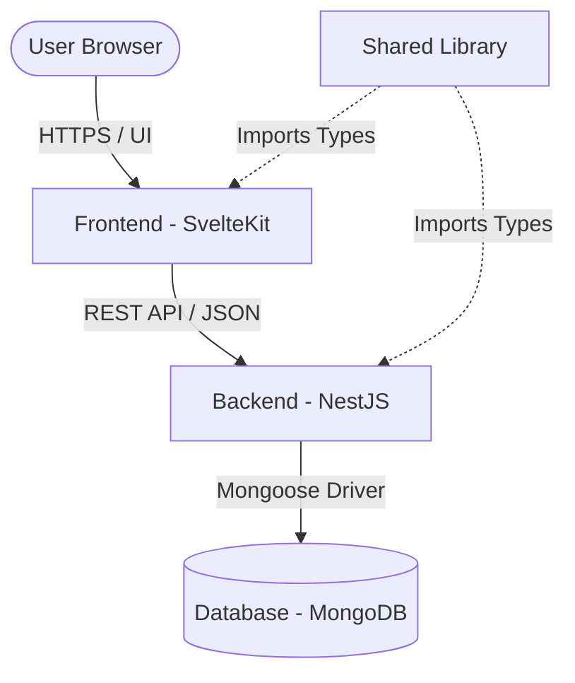
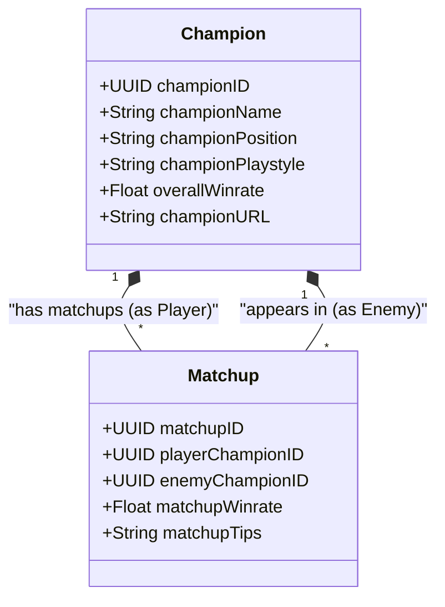

# LeagueMatchups Monorepo

## System Architecture

```mermaid
flowchart TD
    User([User Browser]) -->|HTTPS / UI| FE[Frontend - SvelteKit]
    FE -->|REST API / JSON| BE[Backend - NestJS]
    BE -->|Mongoose Driver| DB[(Database - MongoDB)]
    Shared[Shared Library] -.->|Imports Types| FE
    Shared -.->|Imports Types| BE
```

## Backend Data Models

```mermaid
classDiagram
    Champion "1" *-- "*" Matchup : "has matchups (as Player)"
    Champion "1" *-- "*" Matchup : "appears in (as Enemy)"

    class Champion {
        +UUID championID
        +String championName
        +String championPosition
        +String championPlaystyle
        +Float overallWinrate
        +String championURL
    }
    
    class Matchup {
        +UUID matchupID
        +UUID playerChampionID
        +UUID enemyChampionID
        +Float matchupWinrate
        +String matchupTips
    }
```